# Theme Gallery

35+ ready-to-use themes for the AX206 3.5" USB display. Each folder contains a `.conf` file and a `preview.png`.

## Applying a Theme

**If you installed the `lcd4linux-ax206-themes` package**, use the `lcd4linux-theme` CLI:

```bash
# List all available themes
lcd4linux-theme list

# Apply a theme (backs up your current config automatically)
sudo lcd4linux-theme apply SimpleBlue

# Check what's currently active
lcd4linux-theme current
```

**If you're running from source**, point lcd4linux directly at the config file:

```bash
./lcd4linux -F -f themes/<ThemeName>/<config>.conf
```

---

## Landscape

Full-width layouts with background images, including the Cyberdeck dashboard style.

| | | |
|:---:|:---:|:---:|
| **[LandscapeEarth](LandscapeEarth/)** | **[LandscapeMagicBlue](LandscapeMagicBlue/)** | **[LandscapeModernDevice35](LandscapeModernDevice35/)** |
| [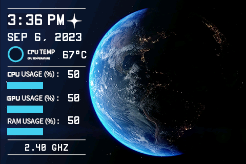](LandscapeEarth/dpf_landscapeearth.conf)<br>*Clean Earth-themed monitor with CPU, GPU, RAM bars and temperature* | [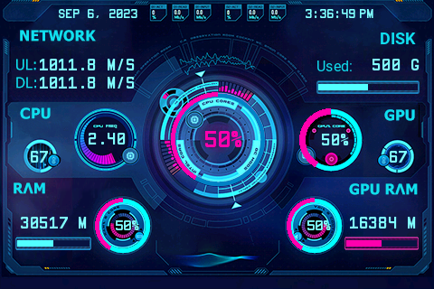](LandscapeMagicBlue/dpf_landscapemagicblue.conf)<br>*Sci-fi dashboard with 4 radial gauges (CPU, GPU, RAM, GPU RAM), network speeds, and disk usage* | [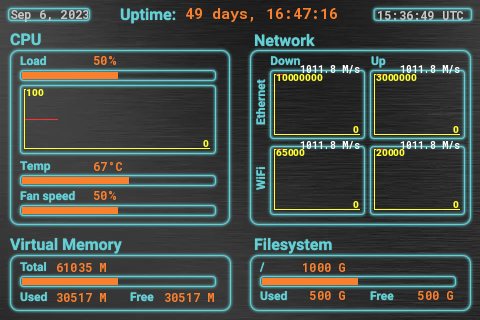](LandscapeModernDevice35/dpf_landscapemoderndevice35.conf)<br>*Server dashboard with CPU sparkline, ETH/WiFi network sparklines, memory, disk, and uptime* |
| **[Cyberdeck](Cyberdeck/)** | | |
| [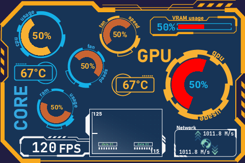](Cyberdeck/dpf_cyberdeck.conf)<br>*Multi-gauge display with CPU, GPU, RAM, fan speeds, FPS sparkline, and network stats* | | |

---

## Cyberpunk / Deck / Terminal

Neon-tinged, high-contrast hacker aesthetics and terminal-style themes.

| | | |
|:---:|:---:|:---:|
| **[Cyberpunk](Cyberpunk/)** | **[Cyberpunk-net](Cyberpunk-net/)** | **[bash-dark-green](bash-dark-green/)** |
| [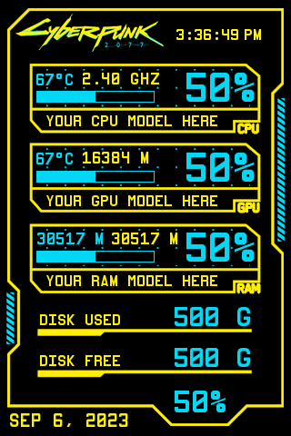](Cyberpunk/dpf_cyberpunk.conf)<br>*Cyberpunk 2077-styled system monitor* | [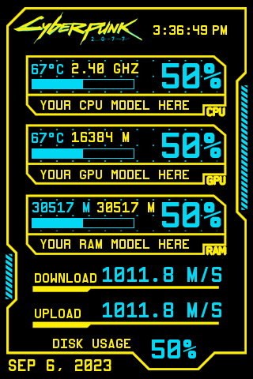](Cyberpunk-net/dpf_cyberpunk-net.conf)<br>*Cyberpunk variant — replaces disk with download/upload speeds* | [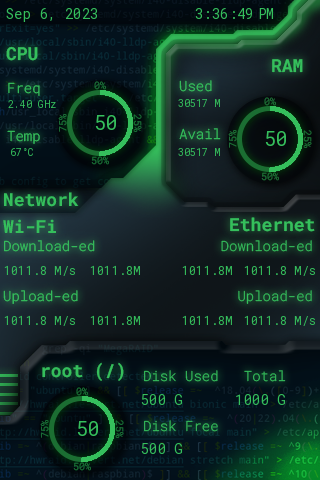](bash-dark-green/dpf_bash_dark_green.conf)<br>*Hacker/terminal-style green-on-black with CPU, RAM, network, and disk gauges* |
| **[bash-dark-green-gpu](bash-dark-green-gpu/)** | | |
| [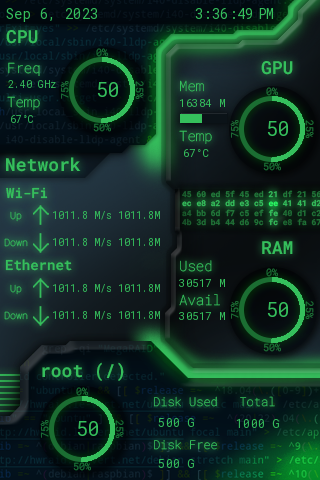](bash-dark-green-gpu/dpf_bash_dark_green_gpu.conf)<br>*GPU variant — adds GPU usage, VRAM, and temperature* | | |

---

## Simple — Blue

Portrait system monitor with CPU, RAM, disk, and network stats.

| | | |
|:---:|:---:|:---:|
| **[SimpleBlue](SimpleBlue/)** | **[SimpleBlueFall](SimpleBlueFall/)** | **[SimpleBlueGauge](SimpleBlueGauge/)** |
| [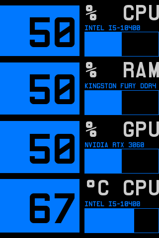](SimpleBlue/dpf_simpleblue.conf)<br>*Standard* | [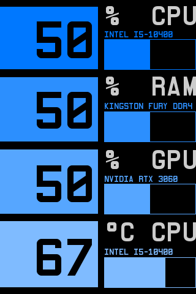](SimpleBlueFall/dpf_simplebluefall.conf)<br>*Alternate background style* | [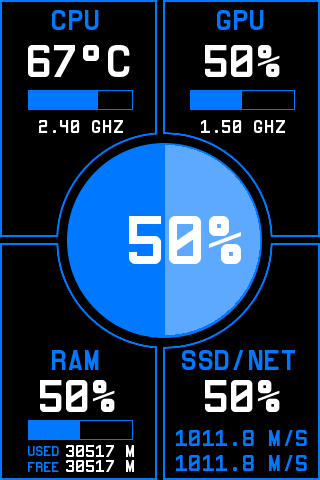](SimpleBlueGauge/dpf_simplebluegauge.conf)<br>*Radial arc gauge meters* |

---

## Simple — Green

Portrait system monitor with CPU, RAM, disk, and network stats.

| | | |
|:---:|:---:|:---:|
| **[SimpleGreen](SimpleGreen/)** | **[SimpleGreenFall](SimpleGreenFall/)** | **[SimpleGreenGauge](SimpleGreenGauge/)** |
| [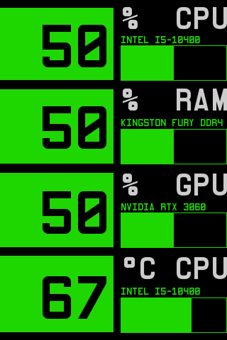](SimpleGreen/dpf_simplegreen.conf)<br>*Standard* | [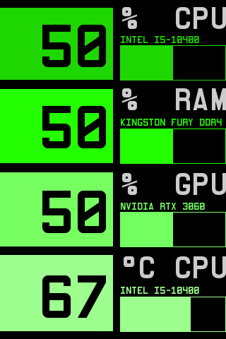](SimpleGreenFall/dpf_simplegreenfall.conf)<br>*Alternate background style* | [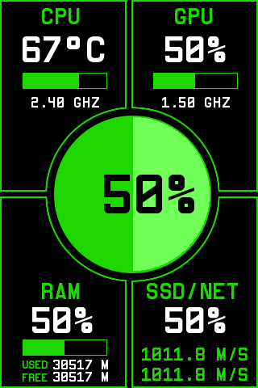](SimpleGreenGauge/dpf_simplegreengauge.conf)<br>*Radial arc gauge meters* |

---

## Simple — Red

Portrait system monitor with CPU, RAM, disk, and network stats.

| | | |
|:---:|:---:|:---:|
| **[SimpleRed](SimpleRed/)** | **[SimpleRedFall](SimpleRedFall/)** | **[SimpleRedGauge](SimpleRedGauge/)** |
| [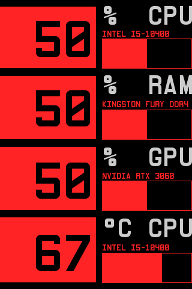](SimpleRed/dpf_simplered.conf)<br>*Standard* | [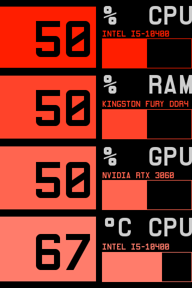](SimpleRedFall/dpf_simpleredfall.conf)<br>*Alternate background style* | [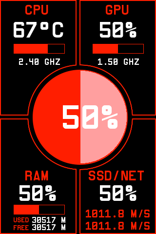](SimpleRedGauge/dpf_simpleredgauge.conf)<br>*Radial arc gauge meters* |
| **[SimpleRedGaugeRedBg](SimpleRedGaugeRedBg/)** | | |
| [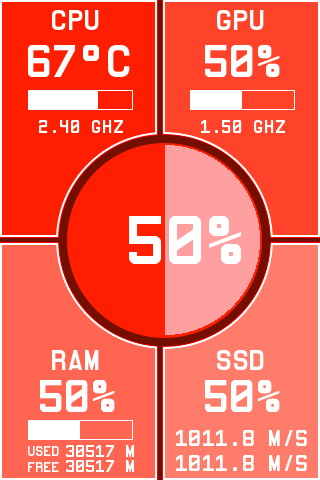](SimpleRedGaugeRedBg/dpf_simpleredgaugeredbg.conf)<br>*Gauge variant with red background* | | |

---

## Simple — Orange

Portrait system monitor with CPU, RAM, disk, and network stats.

| | | |
|:---:|:---:|:---:|
| **[SimpleOrange](SimpleOrange/)** | **[SimpleOrangeFall](SimpleOrangeFall/)** | **[SimpleOrangeGauge](SimpleOrangeGauge/)** |
| [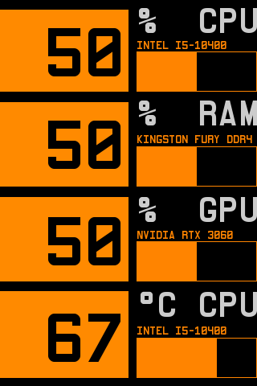](SimpleOrange/dpf_simpleorange.conf)<br>*Standard* | [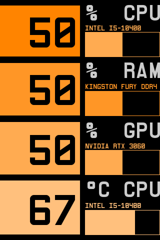](SimpleOrangeFall/dpf_simpleorangefall.conf)<br>*Alternate background style* | [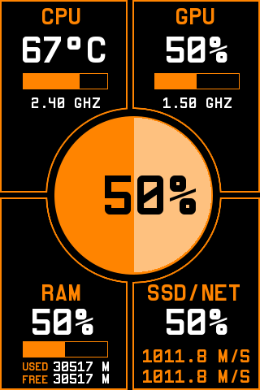](SimpleOrangeGauge/dpf_simpleorangegauge.conf)<br>*Radial arc gauge meters* |

---

## Simple — Yellow

Portrait system monitor with CPU, RAM, disk, and network stats.

| | | |
|:---:|:---:|:---:|
| **[SimpleYellow](SimpleYellow/)** | **[SimpleYellowFall](SimpleYellowFall/)** | **[SimpleYellowGauge](SimpleYellowGauge/)** |
| [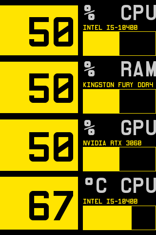](SimpleYellow/dpf_simpleyellow.conf)<br>*Standard* | [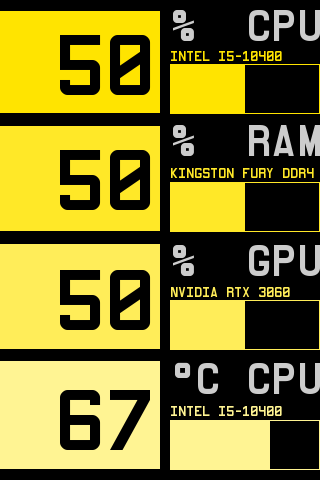](SimpleYellowFall/dpf_simpleyellowfall.conf)<br>*Alternate background style* | [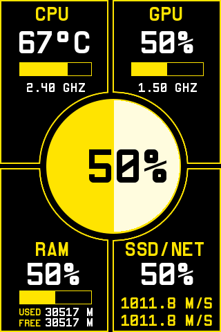](SimpleYellowGauge/dpf_simpleyellowgauge.conf)<br>*Radial arc gauge meters* |

---

## Simple — Purple

Portrait system monitor with CPU, RAM, disk, and network stats.

| | | |
|:---:|:---:|:---:|
| **[SimplePurple](SimplePurple/)** | **[SimplePurpleFall](SimplePurpleFall/)** | **[SimplePurpleGauge](SimplePurpleGauge/)** |
| [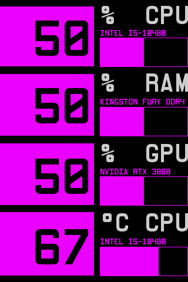](SimplePurple/dpf_simplepurple.conf)<br>*Standard* | [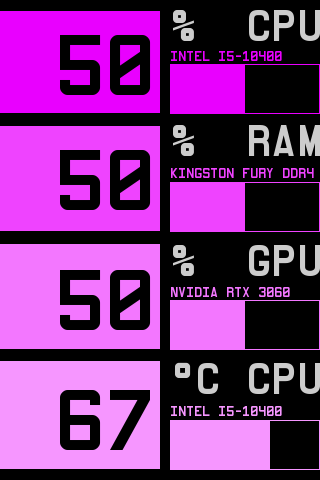](SimplePurpleFall/dpf_simplepurplefall.conf)<br>*Alternate background style* | [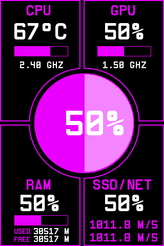](SimplePurpleGauge/dpf_simplepurplegauge.conf)<br>*Radial arc gauge meters* |

---

## Simple — Fire & Neon

| | | |
|:---:|:---:|:---:|
| **[SimpleFire](SimpleFire/)** | **[SimpleFireGauge](SimpleFireGauge/)** | **[SimpleNeon](SimpleNeon/)** |
| [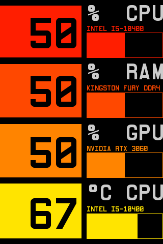](SimpleFire/dpf_simplefire.conf)<br>*Fire-themed system monitor* | [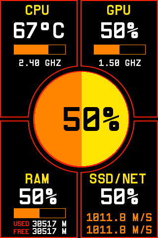](SimpleFireGauge/dpf_simplefiregauge.conf)<br>*Fire-themed radial gauge meters* | [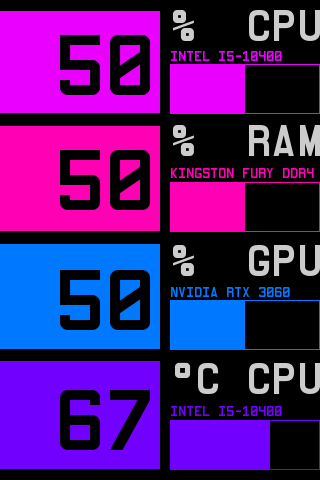](SimpleNeon/dpf_simpleneon.conf)<br>*Neon-lit system monitor* |
| **[SimpleNeonGauge](SimpleNeonGauge/)** | **[SimpleCyberpunkGauge](SimpleCyberpunkGauge/)** | **[SimpleMulticolor](SimpleMulticolor/)** |
| [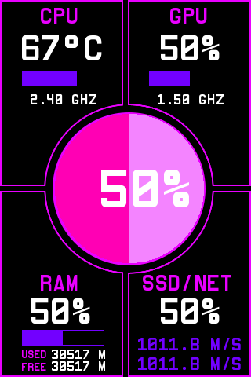](SimpleNeonGauge/dpf_simpleneongauge.conf)<br>*Neon radial gauge meters* | [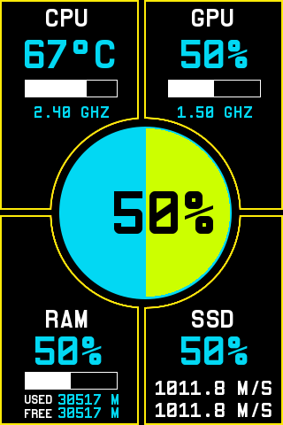](SimpleCyberpunkGauge/dpf_simplecyberpunkgauge.conf)<br>*Cyberpunk-styled radial gauge meters* | [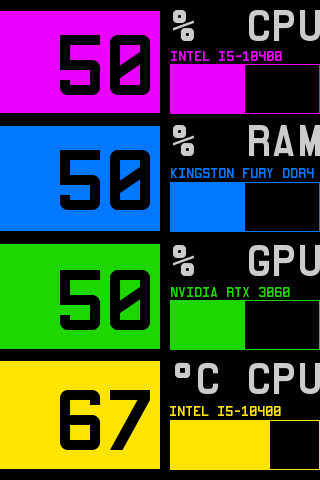](SimpleMulticolor/dpf_simplemulticolor.conf)<br>*Multi-color variant* |

---

## Simple — White

| | | |
|:---:|:---:|:---:|
| **[SimpleWhite](SimpleWhite/)** | **[SimpleWhiteNas](SimpleWhiteNas/)** | **[SimpleWhiteNasIO](SimpleWhiteNasIO/)** |
| [](SimpleWhite/dpf_simplewhite.conf)<br>*Portrait system monitor with CPU, RAM, disk, and network stats* | [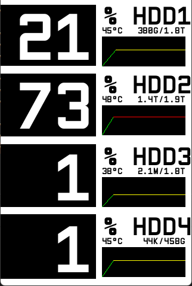](SimpleWhiteNas/dpf_simplewhitenas.conf)<br>*4-bay NAS monitor — drive usage %, size, temperature, and sparkline history per drive. Requires `drivetemp` kernel module.* | [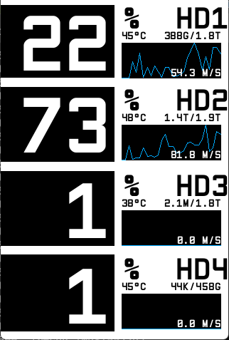](SimpleWhiteNasIO/dpf_simplewhitenasio.conf)<br>*4-bay NAS monitor — drive usage %, temperature, size, and disk I/O throughput sparkline per drive* |
| **[SimpleWhite-FreeBSD](SimpleWhite-FreeBSD/)** | | |
---

## Router / Networking

Specialized layouts for networking gear and router dashboards.

| | | |
|:---:|:---:|:---:|
| **[OPNSense](OPNSense/)** | **[NAS](NAS/)** | |
| [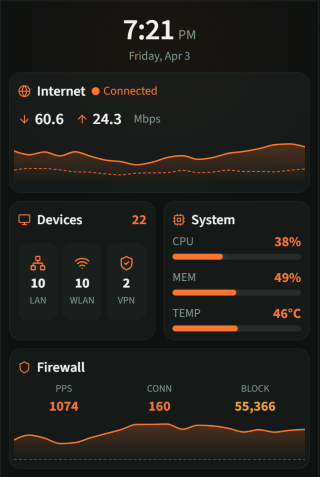](OPNSense/dpf_opnsense.conf)<br>*OPNSense-styled dashboard with network traffic sparklines, connected devices, system health, and firewall stats. Uses Source Sans 3 font.* | [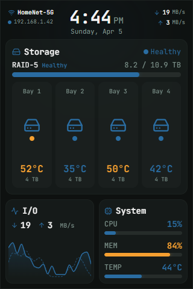](NAS/dpf_4baynas.conf)<br>*4-bay NAS dashboard with per-bay usage, temperature, I/O, mergerfs summary, and network header. JetBrains Mono. Edit `bay*_path`, `bay*_blk`, and `main_storage` in the config for your system.* | |
